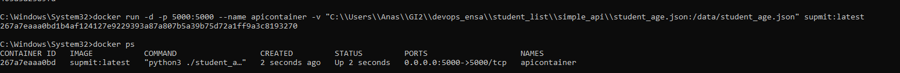
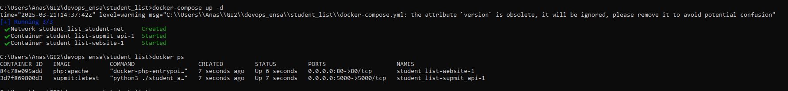
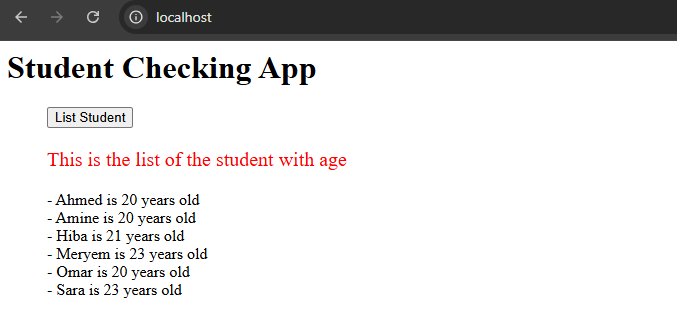

# Rapport de Mini-Projet Docker

## Réalisé par :
- Anas Slimani
- Badr Ezziyati

---

## Sommaire
1. [Introduction](#introduction)
2. [Explication des composants du Dockerfile pour l’API](#explication-des-composants-du-dockerfile-pour-lapi)
3. [Test et validation du conteneur API](#test-et-validation-du-conteneur-api)
4. [Déploiement avec Docker Compose](#déploiement-avec-docker-compose)
5. [Mise en place du registre privé Docker](#mise-en-place-du-registre-privé-docker)

---

## Introduction

Dans un contexte où la conteneurisation est devenue un élément clé du déploiement d'applications modernes, notre projet vise à démontrer l'efficacité de Docker pour la gestion d'une infrastructure logicielle. Ce mini-projet a pour objectif de conteneuriser une application composée d'un backend en Python avec Flask et d’un frontend en PHP.

L'entreprise **SUPMIT**, spécialisée dans le développement de logiciels pour les universités, souhaite améliorer son infrastructure en la rendant plus évolutive, automatisée et facilement déployable. Actuellement, l’application fonctionne sur un serveur unique, ce qui limite sa scalabilité et complexifie son déploiement.

L’objectif principal de ce projet est donc de construire une infrastructure découplée en utilisant Docker. Ce rapport détaille les différentes étapes de la mise en place de cette solution, depuis la création des conteneurs jusqu’au déploiement via Docker Compose et l’hébergement des images dans un registre privé.

---

## Explication des composants du Dockerfile pour l’API

Voici le Dockerfile utilisé pour créer l'image de l'API :

### 1. Choix de l’image de base:

```dockerfile
FROM python:3.8-buster
``` 
* Utilise l’image officielle Python 3.8 basée sur Debian Buster comme
 environnement de base.
* Fournit un système stable avec Python préinstallé.

###  2. Informations sur le mainteneur:
```dockerfile
LABEL maintainer="Anas Slimani <anasslimani039@gmail.com>"
LABEL maintainer="Badr Ezziyati <bziyati11@gmail.com>"
```

* Ajoute des métadonnées pour indiquer les personnes 
responsables de l’image.

### 3. Création du dossier d’application et définition du répertoire de travail:

```dockerfile
RUN mkdir -p /home/app
WORKDIR /app
```

- **mkdir -p /home/app** : Crée un dossier `/home/app` pour poser le projet.
- **WORKDIR /app** : Définit `/app` comme répertoire de travail. C'est là où seront copiés les fichiers et où les commandes seront exécutées.

### 4. Installation des dépendances système :

```dockerfile
RUN apt-get update -y && \
    apt-get install -y python3-dev libssl2-dev libldap2-dev libssl-dev
```

- **apt-get update -y** : Met à jour la liste des paquets disponibles.
- **apt-get install -y ...** : Installe des bibliothèques nécessaires :
  - **python3-dev** : Outils de développement Python.
  - **libsasl2-dev, libldap2-dev, libssl-dev** : Bibliothèques nécessaires pour l’authentification et la sécurité.


### 5. Copie des dépendances Python :

```dockerfile
COPY requirements.txt .
```

- **COPY requirements.txt .** : Copie le fichier requirements.txt
dans le conteneur, à la racine de /app.


###  6. Installation des dépendances Python

```dockerfile
RUN pip3 install --no-cache-dir -r requirements.txt
```

- **pip3 install -r requirements.txt .**  : Installe les bibliothèques
 nécessaires au fonctionnement de l’application.
 
  
- **--no-cache-dir .** : Évite de stocker des fichiers temporaires
 pour réduire la taille de l’image.


### 7. Copie du fichier source de l’API

```dockerfile
COPY student_age.py .
```
Copie le fichier student_age.py (le code de l’API Flask) dans le
 conteneur.

### 8. Création d’un dossier pour les données et déclaration en volume 

```dockerfile
RUN mkdir /data
VOLUME /data
```

- **mkdir /data** : Crée un dossier /data pour stocker les données
 (fichier JSON contenant les étudiants).
- **VOLUME /data** : Déclare /data comme un volume pour permettre
 la persistance des données entre les redémarrages du conteneur.

### 9. Exposition du port de l’API
```dockerfile
EXPOSE 5000
```
Indique que le conteneur écoutera
 sur le port 5000, qui est celui par
 défaut pour Flask.

### 10. Commande de démarrage
```dockerfile
CMD ["python3", "./student_age.py"]
```

- **Définit la commande qui sera exécutée lors du démarrage du conteneur** :
    - **python3 ./student_age.py** : Lance le script Flask pour exécuter l’API.

- **Utilisation de CMD plutôt que RUN, car CMD est exécuté au lancement du conteneur, tandis que RUN est exécuté lors de la construction de l’image**.

---
## Test et validation du conteneur API

### Création de l’image submit:1.0 d’après le Dockerfile


---

###  Démarage de container: 

---

###  Récupération des données d’apres le fichier student_age.json: 

---

## Déploiement-avec-docker-compose

### Explication du fichier docker compose : 

####  1. Définition de la version de Docker Compose :

```yaml
version: '3'
```
* Spécifie que le fichier utilise la version 3 de
 Docker Compose, une version stable et
 largement utilisée.

####  2. Définition des services : 
```yaml
services:
```

Ce fichier définit deux services :
- **supmit_api** → L’API Flask qui fournit la liste des étudiants.
- **website** → L’application web en PHP qui consomme l’API.


#### 3. Service : supmit_api (API Flask)
```yaml
  supmit_api :
    image: supmit:latest  
    ports:
      - "5000:5000"  
    volumes:
      - ./simple_api/student_age.json:/data/student_age.json  
    networks:
      - student-net  
```

- **image**: supmit:latest(au lieu de supmit:1.0) → Utilise l’image
 Docker "supmit", construite précédemment, avec le tag latest.
- **ports**:
    - **5000:5000** → Mappe le port 5000 du conteneur sur le port
 5000 de la machine hôte.
- **volumes**:
    - **./simple_api/student_age.json:/data/student_age.json** 
        - **Monte le fichier student_age.json de l’hôte dans le
 dossier /data du conteneur pour que l’API puisse
 accéder aux données.**
 - **networks**:
 student-net → Ajoute le conteneur au réseau student-net,
 permettant la communication avec le frontend.

#### 4. Service : website (Application PHP + Apache)

```yaml
  website:
    image: php:apache  
    ports:
      - "80:80"  
    environment:
      - USERNAME=root  
      - PASSWORD=root  
    volumes:
      - ./website:/var/www/html  
    depends_on:
      - supmit_api  
    networks:
      - student-net
```


- **`image: php:apache`** : Utilise l’image officielle PHP avec Apache pour servir le site web.
- **`ports:`**
  - `80:80` : Mappe le port 80 du conteneur sur le port 80 de la machine hôte, rendant le site accessible via `http://localhost`.
- **`environment:`**
  - Définit les variables d’environnement `USERNAME` et `PASSWORD` (probablement utilisées pour l’authentification avec l’API).
- **`volumes:`**
  - `./website:/var/www/html` : Monte le dossier `./website` de l’hôte dans `/var/www/html` du conteneur pour que le site web puisse être servi.
- **`depends_on:`**
  - `submit_api` : Assure que l’API démarre avant le site web, évitant les erreurs de connexion au backend.
- **`networks:`**
  - `student-net` : Relie ce service au même réseau que l’API, permettant leur communication.

#### 5. Définition du réseau : 
```yaml
networks:
  student-net:
```  
-  Définit un réseau Docker personnalisé (student-net)
 pour que les conteneurs puissent communiquer entre
 eux.

### 6. Exécution de la commande docker-compose up -d


---




## Mise en place du registre privé Docker

### explication du fichier docker-compose-registry : 
#### - Services
Les services définissent les conteneurs qui seront lancés par Docker Compose. Dans ce fichier, deux services sont définis : registry et registry-ui.

#### Service registry : 
```yaml
registry:
  image: registry:2  
  container_name: registry
  ports:
    - "5000:5000"  
  volumes:
    - registry_data:/var/lib/registry 
  networks:
    - registry-net
```

- **image: registry:2** : Utilise l'image officielle de Docker Registry (version 2) pour créer le conteneur. Cette image permet de déployer un registre privé pour stocker des images Docker.

- **container_name**: registry : Donne un nom explicite au conteneur (registry) pour faciliter son identification.

- **ports: - "5000:5000"** : Mappe le port 5000 du conteneur sur le port 5000 de la machine hôte. Cela permet d'accéder au registre via http://localhost:5000.

- **volumes: - registry_data:/var/lib/registry** : Crée un volume Docker nommé registry_data et le monte dans le conteneur à l'emplacement /var/lib/registry. Ce volume est utilisé pour stocker les images Docker de manière persistante (les données ne sont pas perdues lorsque le conteneur est redémarré ou supprimé).

- **networks: - registry-net** : Connecte ce service au réseau Docker personnalisé registry-net. Cela permet au registre de communiquer avec d'autres services sur le même réseau.

### Service registry-ui
```yaml
registry-ui:
  image: joxit/docker-registry-ui:latest 
  container_name: registry-ui
  ports:
    - "8080:80" 
  environment:
    - REGISTRY_TITLE=SUPMIT Private Registry  
    - REGISTRY_URL=http://localhost:5000 
  depends_on:
    - registry  
  networks:
    - registry-net
```
- **image: joxit/docker-registry-ui:latest** : Utilise l'image joxit/docker-registry-ui pour fournir une interface web conviviale pour gérer le registre Docker.

- **container_name: registry-ui** : Donne un nom explicite au conteneur (registry-ui) pour faciliter son identification.

- **ports: - "8080:80"** : Mappe le port 80 du conteneur sur le port 8080 de la machine hôte. Cela permet d'accéder à l'interface web via http://localhost:8080.

- **environment :** Définit des variables d'environnement pour configurer l'interface web :

    - **REGISTRY_TITLE=SUPMIT Private Registry** : Définit le titre de l'interface web.

  - **REGISTRY_URL=http://localhost:5000**: Spécifie l'URL du registre Docker auquel l'interface web doit se connecter. Ici, elle pointe vers http://localhost:5000.

- **depends_on: - registry** : Indique que le service registry-ui dépend du service registry. Cela garantit que le registre Docker démarre avant l'interface web.

- **networks: - registry-net** : Connecte ce service au même réseau Docker personnalisé (registry-net) que le registre, permettant une communication entre les deux services.

### 3. Volumes
```yml
volumes:
  registry_data:
```

- **Explication** : Définit un volume Docker nommé registry_data. Ce volume est utilisé pour stocker les données du registre Docker de manière persistante. Il est monté dans le conteneur registry à l'emplacement /var/lib/registry.

### 4. Réseaux
```yml
networks:
  registry-net:
```

- **Explication :** Définit un réseau Docker personnalisé nommé registry-net. Ce réseau permet aux services registry et registry-ui de communiquer entre eux. Les conteneurs sur le même réseau peuvent se "voir" et interagir.

## Test : 
* Démarage de docker-compose-registry : 

 

* push supmit image to localhost:5000

 

 * push test : 

 